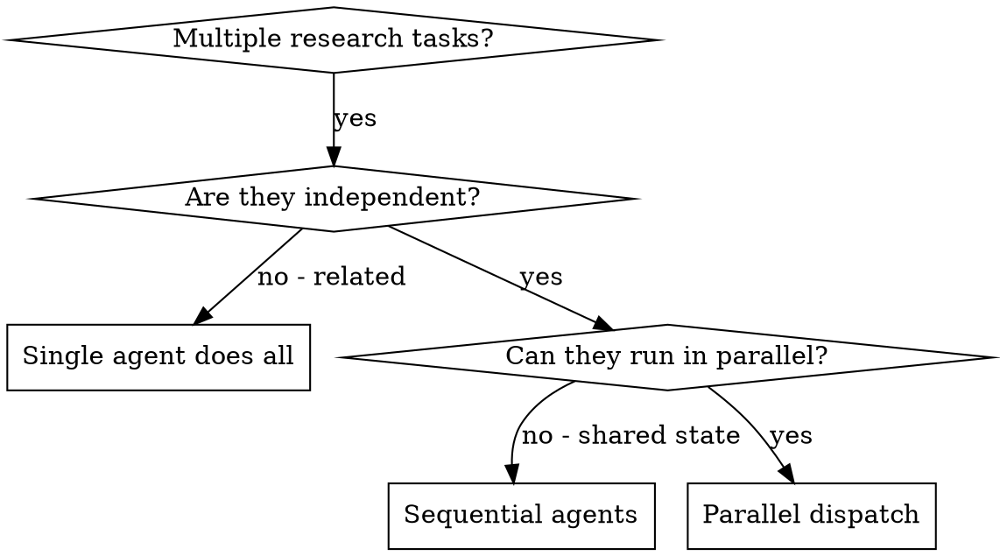

# PM Parallel Research

Delegate independent PM research tasks to parallel subagents. When you have multiple competitors to analyze, multiple user segments to research, or multiple discovery activities that don't depend on each other — dispatch them concurrently instead of sequentially.

**Core principle:** One agent per independent research domain. Let them work concurrently. Synthesize when all return.

**Announce at start:** "I'm using the pm-parallel-research skill to dispatch parallel research tasks."

## When to Use



**Use when:**
- 3+ competitors to analyze simultaneously
- Multiple user segments to research independently
- Independent discovery activities (market sizing + competitor review + user interviews synthesis)
- Each task can produce results without context from other tasks
- No shared state between investigations

**Don't use when:**
- Tasks are sequential (output of A feeds into B)
- Need to understand the full picture before deciding
- Tasks would produce conflicting conclusions without coordination
- Exploratory research where you don't know the scope yet

## The Process

### Step 1: Identify Independent Domains

Group research by domain:

```
Domain A: Competitor Analysis — Research Competitor X's pricing, features, positioning
Domain B: User Research — Synthesize 5 recent customer interviews
Domain C: Market Sizing — Estimate TAM/SAM/SOM for the new segment
```

Each domain is independent — pricing research doesn't affect interview synthesis.

### Step 2: Create Focused Agent Tasks

Each agent gets:
- **Specific scope**: One research domain
- **Clear goal**: What question are they answering?
- **Sources**: Where to look (provided, not discovered)
- **Output format**: Exactly what to return (table, summary, recommendations)

### Step 3: Dispatch in Parallel

```
Agent 1 → Research Competitor X's pricing and features
Agent 2 → Synthesize interviews for activation pain points
Agent 3 → Estimate market size for enterprise segment
// All three run concurrently
```

### Step 4: Review and Synthesize

When agents return:
- Read each result
- Check for conflicting findings
- Cross-reference insights across domains
- Synthesize into a unified brief

## Agent Prompt Structure

Good agent prompts are:
1. **Focused** — One clear research question
2. **Self-contained** — All context and sources provided
3. **Specific about output** — What format, what detail level

```markdown
Analyze Competitor X's product positioning and pricing.

## Context
We're evaluating whether to enter the mid-market analytics space.
Competitor X is the #2 player. We need to understand their strategy.

## Your Task
1. Research Competitor X's public-facing product pages, pricing page, and recent blog posts
2. Identify their pricing tiers, key features per tier, and target customer segments
3. Note any recent positioning shifts (new homepage messaging, new verticals, new case studies)

## Output Format
Return a structured analysis:

### Pricing
| Tier | Price | Key Features | Target Segment |
|------|-------|-------------|----------------|
| ... | ... | ... | ... |

### Positioning
- Primary value prop (1 sentence)
- Target personas
- Key differentiators they claim
- Recent positioning changes

### Strengths & Weaknesses
- What they do better than us
- Where they're vulnerable

### Recommendations
- 3 actionable insights for our strategy
```

## PM Research Scenarios

### Competitive Analysis (3+ competitors)

```
Agent 1 → Competitor A deep-dive (pricing, features, positioning)
Agent 2 → Competitor B deep-dive
Agent 3 → Competitor C deep-dive
Agent 4 → Market trends and adjacent threats
```

### User Research Synthesis

```
Agent 1 → Synthesize interviews #1-5 (activation problems)
Agent 2 → Synthesize interviews #6-10 (retention patterns)
Agent 3 → Extract all direct quotes about pricing/value
```

### Discovery Deep-Dive

```
Agent 1 → Analyze support tickets for top pain points (last 90 days)
Agent 2 → Review competitor app store reviews for differentiation gaps
Agent 3 → Synthesize sales team feedback from last 5 deal losses
```

### Launch Preparation

```
Agent 1 → Research launch benchmarks for our category
Agent 2 → Draft competitive comparison for sales battle cards
Agent 3 → Review similar product launches for lessons learned
```

## Common Mistakes

**Too broad**: "Analyze the market" — agent gets lost
**Specific**: "Analyze Competitor X's pricing tiers and target segments"

**No sources**: Agent fabricates or guesses
**Sources provided**: "Research their public pricing page and G2 reviews"

**No output format**: Agent returns unstructured wall of text
**Format specified**: "Return as a table with these columns..."

**Vague ask**: "Tell me about competitors"
**Specific question**: "What pricing model does each competitor use and which segments do they target?"

**Related tasks grouped**: Output of A needed for B, but dispatched in parallel
**Correct**: Sequential if dependent, parallel only if independent

## When NOT to Use

- **Sequential research**: Output of A feeds into B (run sequentially)
- **Need full context**: Understanding requires seeing the entire landscape at once
- **Exploratory**: You don't know what questions to ask yet
- **Shared conclusions**: Tasks would arrive at conflicting recommendations without coordination

## Key Benefits

1. **Speed** — 3 research tasks complete in time of 1
2. **Depth** — Each agent focuses deeply on one domain
3. **Fresh perspective** — Each agent starts with clean context, no anchoring bias
4. **Your context preserved** — You stay focused on synthesis, not deep research

## Verification

After agents return:
1. **Review each result** — Does it answer the question?
2. **Check for quality** — Are claims sourced? Is the analysis sound?
3. **Cross-reference** — Do findings from different agents conflict or reinforce?
4. **Synthesize** — Write the unified brief. Cite which agent contributed what.

## Real-World Impact

From a competitive strategy session:
- 5 competitors to analyze for a market entry decision
- 5 agents dispatched in parallel
- All deep-dives completed concurrently
- Synthesized into a single competitive landscape brief
- Decision made in one session instead of five serial research cycles
