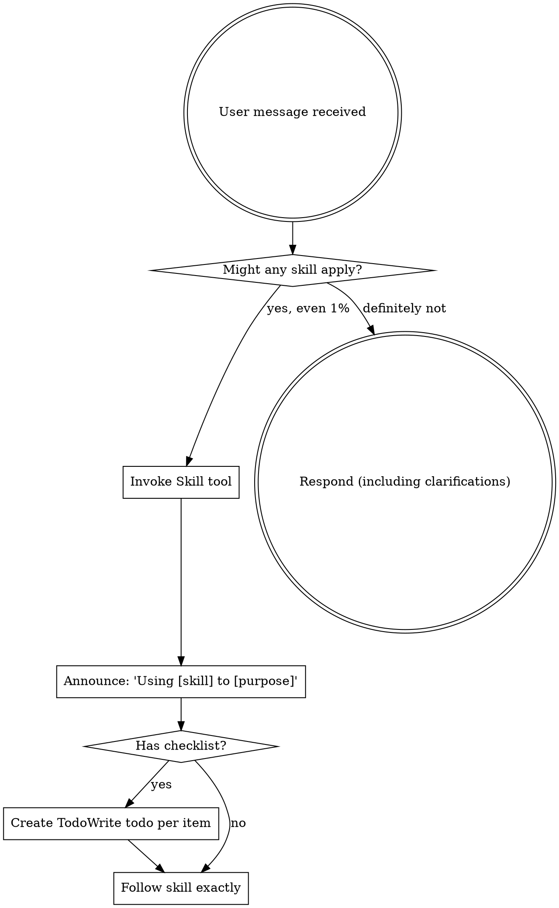

<SUBAGENT-STOP>
If you were dispatched as a subagent to execute a specific task, skip this skill.
</SUBAGENT-STOP>

<EXTREMELY-IMPORTANT>
If you think there is even a 1% chance a skill might apply to what you are doing, you ABSOLUTELY MUST invoke the skill.

IF A SKILL APPLIES TO YOUR TASK, YOU DO NOT HAVE A CHOICE. YOU MUST USE IT.

This is not negotiable. This is not optional. You cannot rationalize your way out of this.
</EXTREMELY-IMPORTANT>

## Instruction Priority

Product Superpowers skills override default system prompt behavior, but **user instructions always take precedence**:

1. **User's explicit instructions** (CLAUDE.md, AGENTS.md, direct requests) — highest priority
2. **Product Superpowers skills** — override default system behavior where they conflict
3. **Default system prompt** — lowest priority

If AGENTS.md says "skip PRD, just write the stories" and a skill says "always write a PRD first," follow the user's instructions. The user is in control.

## How to Access Skills

**In Claude Code:** Use the `Skill` tool. When you invoke a skill, its content is loaded and presented to you — follow it directly. Never use the Read tool on skill files.

**In OpenCode:** Use the `skill` tool. Skills are auto-discovered from installed plugins.

## Platform Adaptation

Skills use Claude Code tool names. Non-CC platforms: adapt tool names to your platform's equivalents (e.g., `TodoWrite` → `todowrite`, `Task` → subagent dispatch).

# Using Skills

## The Rule

**Invoke relevant or requested skills BEFORE any response or action.** Even a 1% chance a skill might apply means that you should invoke the skill to check.

## Skill Catalog

### Core Workflow (process skills — use in order)

| Skill | Trigger | Description |
|-------|---------|-------------|
| **product-discovery** | New product idea, feature request, "build X" | Understand problem, JTBD, user interviews, opportunity assessment |
| **writing-prd** | After discovery approved | Write PRD in Amazon PR/FAQ, SVPG Brief, or Shreyas Doshi format |
| **user-story-writing** | After PRD approved | Break PRD into user stories with INVEST, Gherkin acceptance criteria |

### Decision Making (use throughout)

| Skill | Trigger | Description |
|-------|---------|-------------|
| **prioritization** | "prioritize", "what should we build first", backlog grooming | Score and order backlog using RICE, ICE, MoSCoW, Kano |
| **roadmapping** | "roadmap", "OKRs", "planning", "strategy" | Outcome-based roadmap, Now/Next/Later, OKRs |

### Execution (use when ready to ship)

| Skill | Trigger | Description |
|-------|---------|-------------|
| **design-handoff** | "handoff", "design specs", "ready for engineering" | Design specs, tokens, states, accessibility, QA checklist |
| **launch-planning** | "launch", "release", "GTM", "go live" | GTM strategy, launch checklists, beta, rollout |
| **stakeholder-management** | "update stakeholders", "status report", "executive summary" | Status updates, managing up, conflict resolution |
| **product-analytics** | "metrics", "KPIs", "analytics", "A/B test" | North Star, AARRR, feature adoption, experiment design |
| **pm-feedback-synthesis** | User interviews, survey responses, support tickets, reviews | Cluster themes, extract evidence, produce actionable insights |

### Continuous Strategy (use proactively)

| Skill | Trigger | Description |
|-------|---------|-------------|
| **competitive-analysis** | "competitors", "competitive landscape", "SWOT" | SWOT, Porter's Five Forces, feature comparison |
| **product-strategy** | "strategy", "vision", "build vs buy", "PMF" | Vision, mission, build vs buy, PMF assessment |
| **continuous-discovery** | "discovery process", "OST", "assumption testing", "user research cadence" | Teresa Torres: OSTs, assumption testing, product trio |

### Agentic (subagent-powered workflows)

| Skill | Trigger | Description |
|-------|---------|-------------|
| **pm-parallel-research** | Multiple independent research tasks, 3+ competitors to analyze | Dispatch parallel subagents for concurrent PM research |
| **pm-artifact-review** | PRD/stories/roadmap complete, before sharing with stakeholders | Two-stage review (spec compliance + PM quality) via subagent |
| **pm-visual-workspace** | Presenting OSTs, story maps, roadmaps, prioritization matrices | Browser-based visual companion for PM diagrams |
| **pm-autonomous-execution** | PM plan ready, want agentic execution with review gates | Fresh subagent per task + review between each

## Skill Priority

When multiple skills could apply, use this order:

1. **Process skills first** (product-discovery, writing-prd, user-story-writing) — these determine HOW to approach the task
2. **Decision skills second** (prioritization, roadmapping) — these guide WHAT to prioritize
3. **Execution skills third** (design-handoff, launch-planning, stakeholder-management, product-analytics) — these guide SHIPPING
4. **Strategy skills fourth** (competitive-analysis, product-strategy, continuous-discovery) — these provide ongoing direction
5. **Agentic skills** (pm-parallel-research, pm-artifact-review, pm-visual-workspace, pm-autonomous-execution) — these leverage subagents for speed and quality

"Let's build feature X" → product-discovery first, then writing-prd, then user-story-writing.
"We need to prioritize the backlog" → prioritization.
"Let's update the roadmap" → roadmapping.

## Skill Types

**Rigid:** Follow exactly. Don't adapt away discipline.
- product-discovery (hard gate prevents skipping discovery)
- writing-prd (hard gate requires discovery completion)
- user-story-writing (hard gate requires PRD approval)

**Flexible:** Adapt principles to context.
- prioritization, roadmapping, design-handoff, launch-planning, stakeholder-management, product-analytics, competitive-analysis, product-strategy, continuous-discovery
- pm-parallel-research, pm-artifact-review, pm-visual-workspace, pm-autonomous-execution

The skill itself tells you which.

## User Instructions

Instructions say WHAT, not HOW. "Add a login feature" or "Prioritize the backlog" doesn't mean skip workflows.

## Red Flags

These thoughts mean STOP — you're rationalizing:

| Thought | Reality |
|---------|---------|
| "This is just a simple feature" | Every feature starts with discovery. |
| "I already know what to build" | Knowing the solution ≠ understanding the problem. |
| "Let me just write the PRD first" | Discovery comes before PRD. Always. |
| "The user said to skip discovery" | User instructions override. But warn them about the risk. |
| "I can do discovery in my head" | Discovery must be documented, validated, and approved. |
| "This doesn't need a formal PRD" | If a skill exists, use it. |
| "I remember this skill" | Skills evolve. Read current version. |
| "The skill is overkill for this" | Simple things become complex. Use it. |
| "I'll just do this one thing first" | Check BEFORE doing anything. |
| "We already have research" | Has it been structured into a discovery doc? Apply the skill. |
| "This feels productive" | Undisciplined action wastes time. Skills prevent this. |
| "I know that framework" | Knowing a concept ≠ using the skill. Invoke it. |
